# R'Coffee Server

## About

R'Coffee Server is the backend component of the R-Coffee application, designed following the MVC (Model-View-Controller) architecture. This project is developed using Node.js, Express.js and Bootstrap 4 custom from [Breeze-Free-Bootstrap-Admin-Template](https://github.com/BootstrapDash/Breeze-Free-Bootstrap-Admin-Template) , providing APIs for the app and CRUD operations for management and authentication. Read more about [Frontend](https://github.com/SUMMER24-R-Coffee/R-Coffee_App)

## Features

- **Product Management**: CRUD operations for coffee products.
- **Order Management**: Handle customer orders and transactions.
- **Database Integration**: MySQL for data persistence.

## Installation

1. Clone the repository:
    ```bash
    git clone https://github.com/SUMMER24-R-Coffee/R-Coffee_Server.git
    cd R-Coffee_Server
    ```

2. Install dependencies:
    ```bash
    npm install
    ```

3. Set up environment variables:
    Create a `.env` file in the root directory and add the necessary configurations:
    ```
    # MySQL
    DB_HOST=your_mysql_host
    DB_USER=your_mysql_user
    DB_NAME=your_mysql_database
    DB_PASSWORD=your_mysql_password
    DB_PORT=3306

    # Cloudinary
    CLOUDINARY_CLOUD_NAME=your_cloudinary_cloud_name
    CLOUDINARY_API_KEY=your_cloudinary_api_key
    CLOUDINARY_API_SECRET=your_cloudinary_api_secret

    # Email
    EMAIL_USER=your_email_user
    EMAIL_PASS=your_email_password
    ```

4. Run the server:
    ```bash
    npm start
    ```

## Usage

- Access the server at `http://localhost:3000`.
## Screens Shot
| |
|---|
|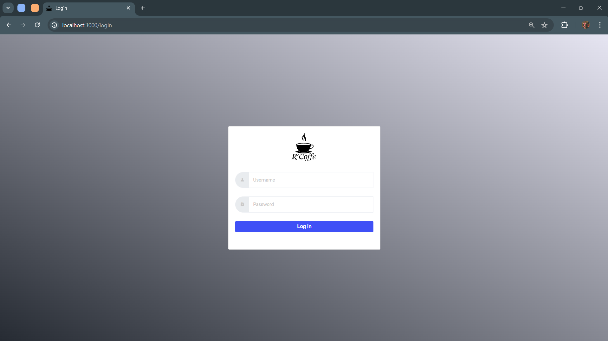<h4 align="center">Login</h4> |
|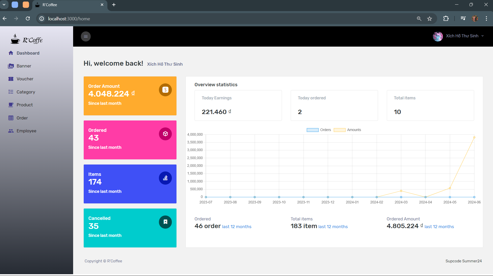<h4 align="center">Dasboard</h4> |
|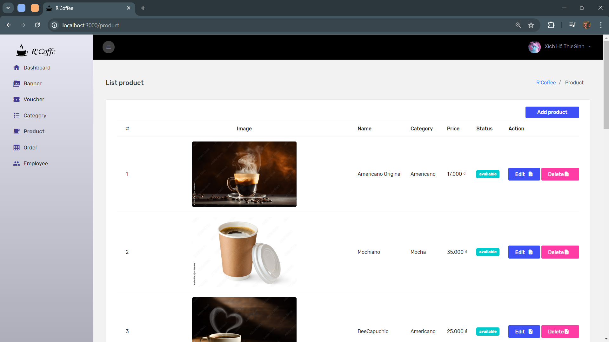<h4 align="center">Product</h4> |
|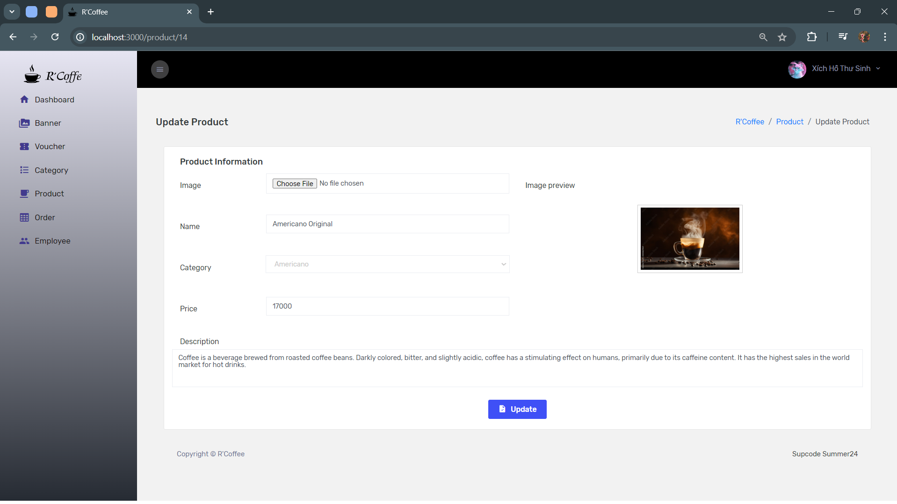<h4 align="center">Detail Product</h4> |
|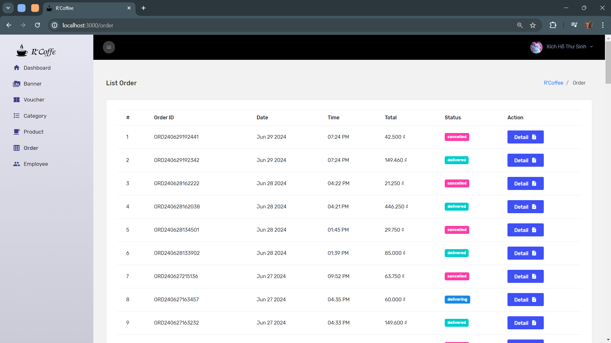<h4 align="center">Order</h4> |
|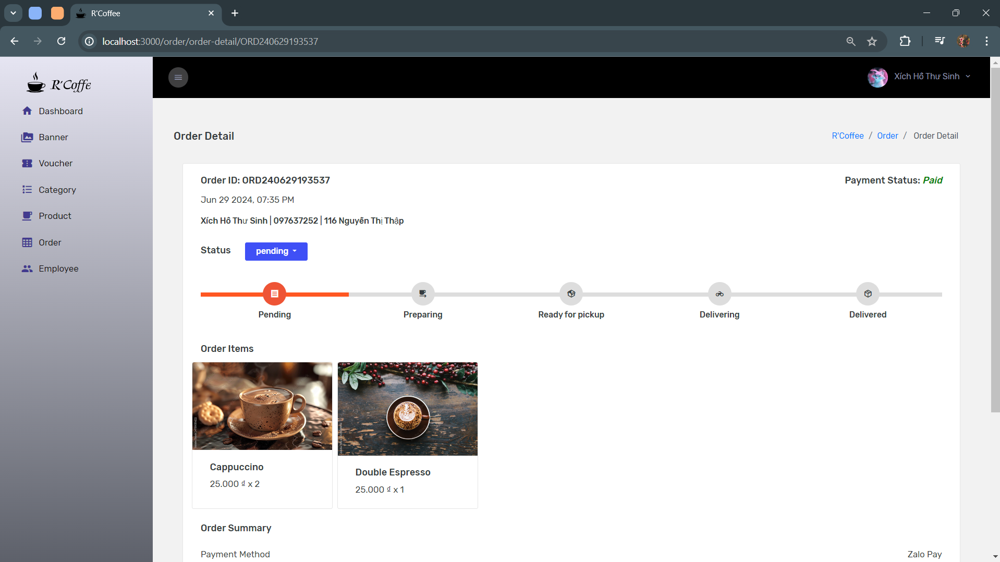<h4 align="center">Order Detail</h4> |
|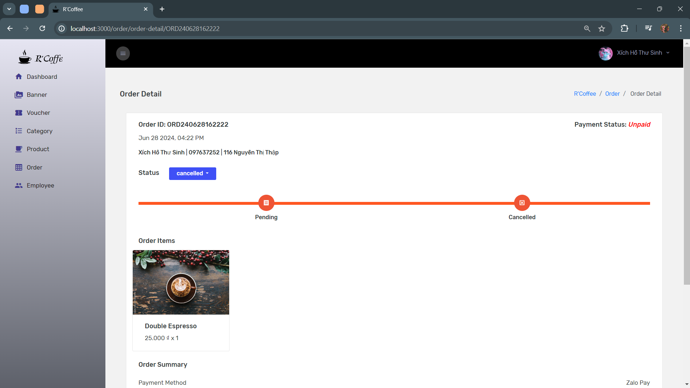<h4 align="center">Order Detail</h4> |
|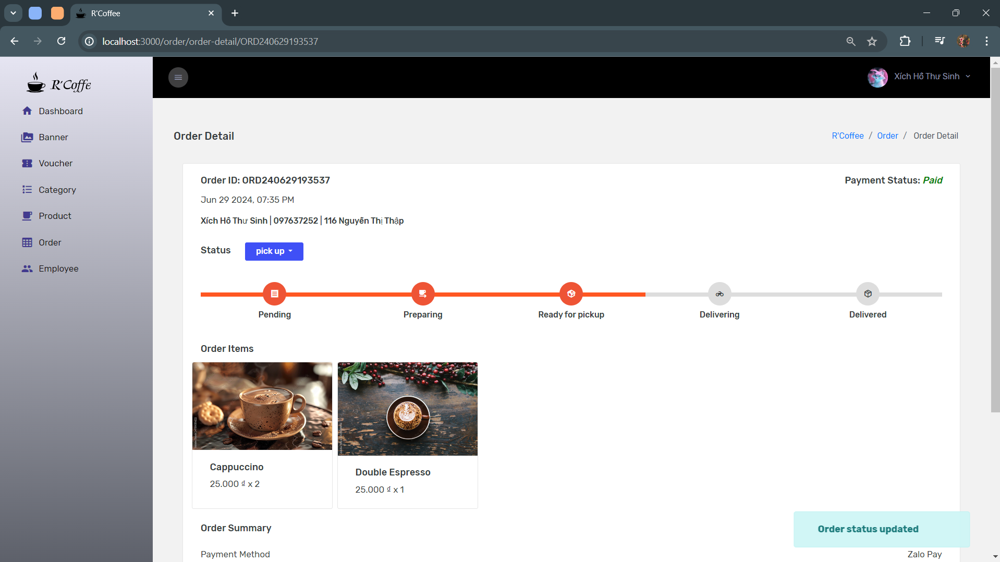<h4 align="center">Order Detail</h4> |
|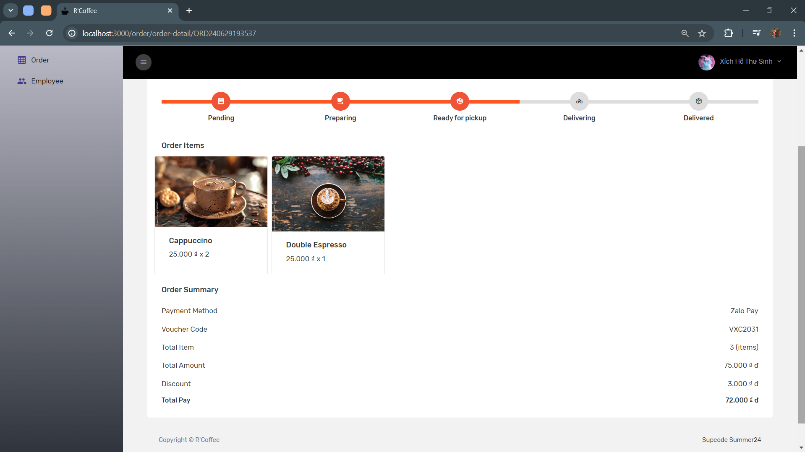<h4 align="center">Order Detail</h4> |
|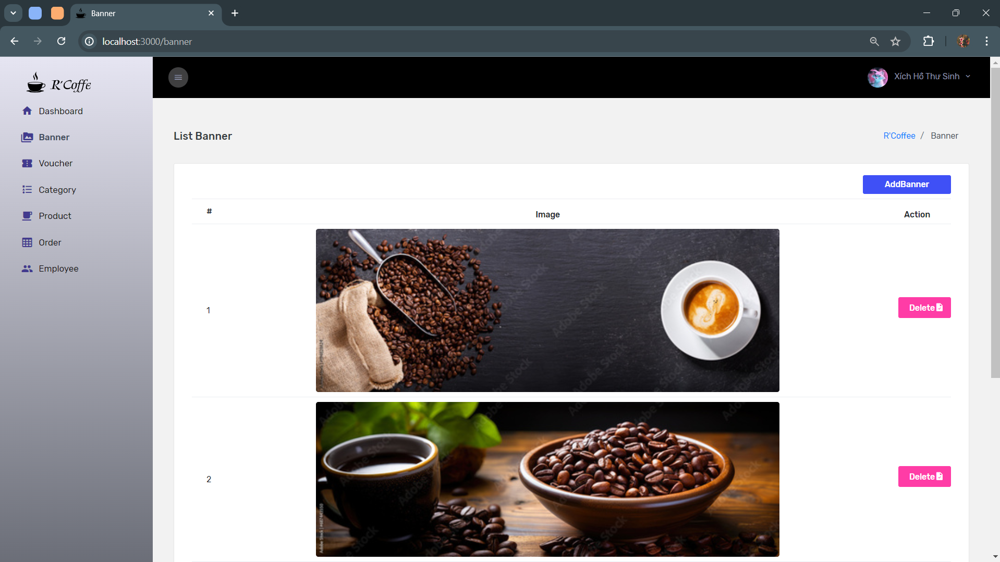<h4 align="center">Baner</h4> |
|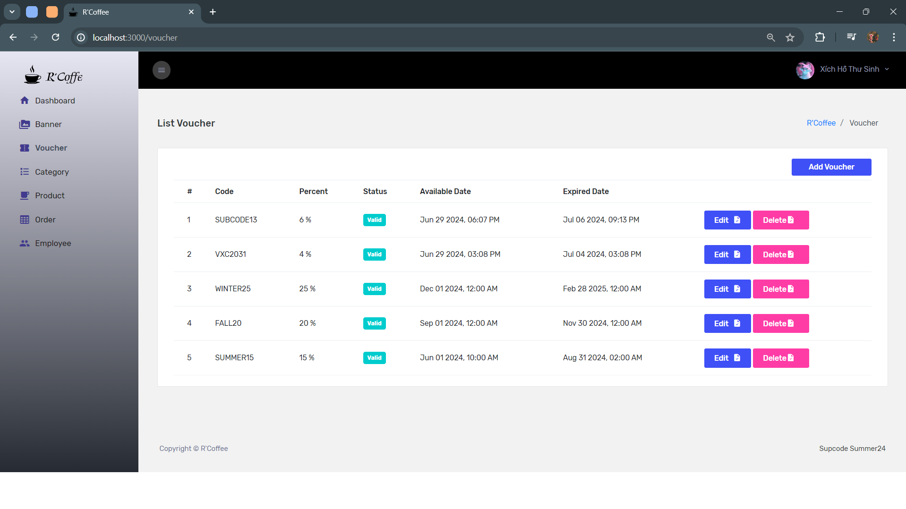<h4 align="center">Voucher</h4> |
|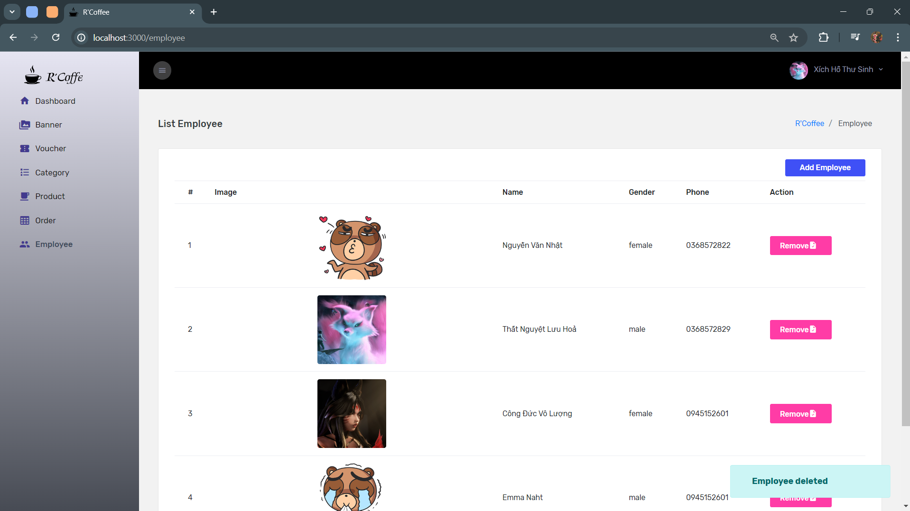<h4 align="center">Employee</h4> |
|<h4 align="center">Modal Add</h4> |
|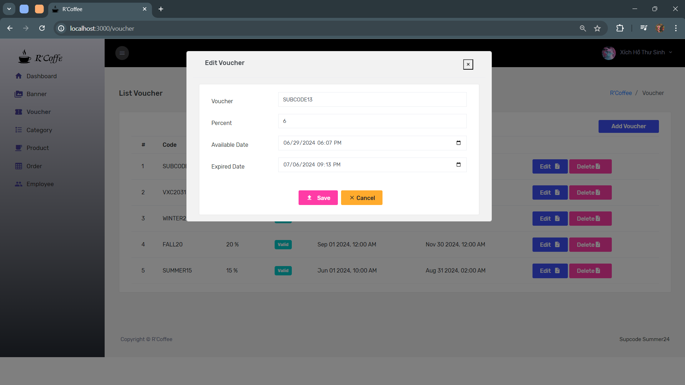<h4 align="center">Modal Edit</h4> |
|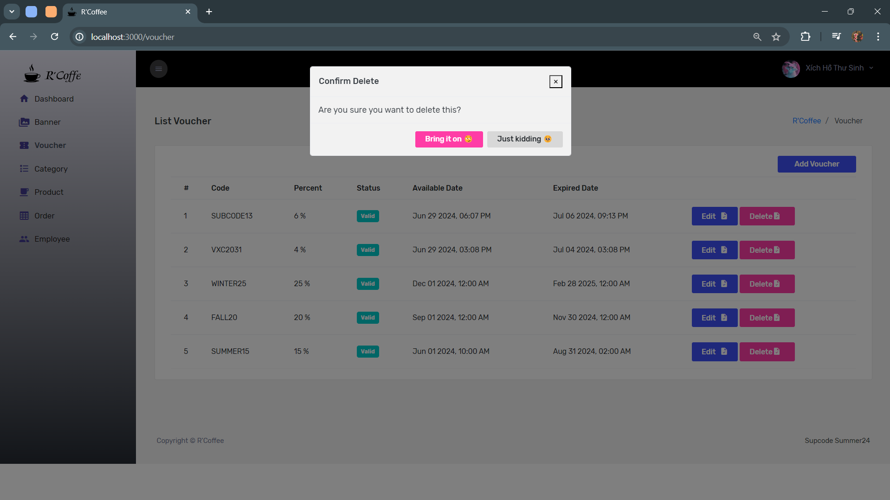<h4 align="center">Modal Delete</h4> |

## Contact

For any inquiries or feedback, please reach out to [datlowashere@gmail.com](mailto:datlowashere@gmail.com).
### Note
This is not the final version, this application will be further improved in the future.
